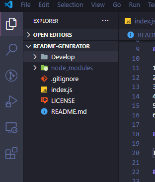
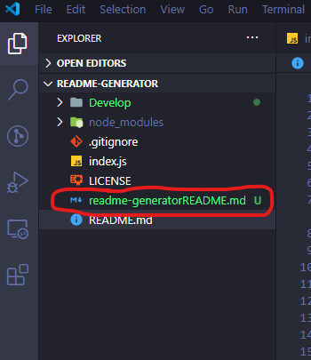
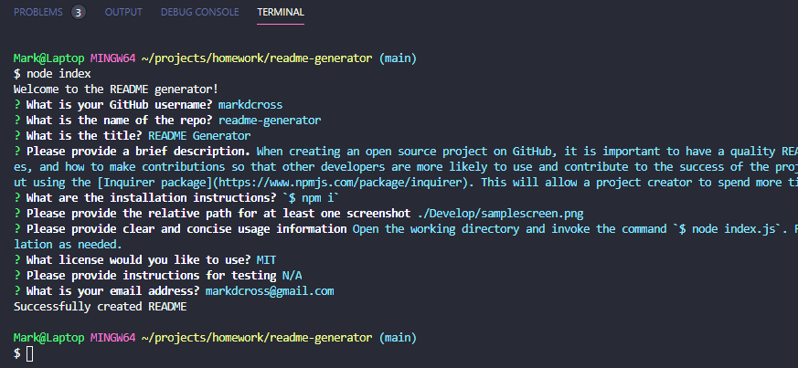
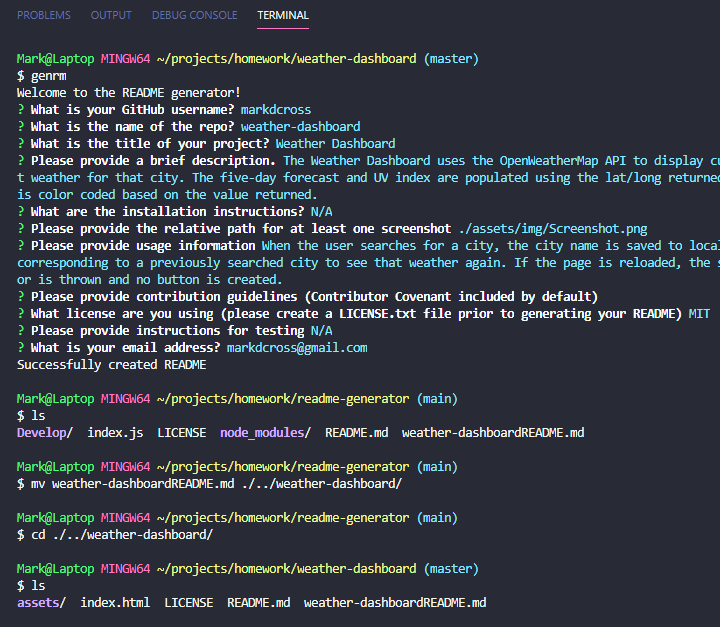

# README Generator

## Description

When creating an open source project on GitHub, it is important to have a quality README with information about the app--what is the app for, how to use the app, how to install it, how to report issues, and how to make contributions so that other developers are more likely to use and contribute to the success of the project. A command-line application will allow for quick and easy generation of a project README to get started quickly. This will allow a project creator to spend more time working on finishing the project and less time creating a good README.

This is a command-line application that dynamically generates a professional README.md from a user's input using the [Inquirer package](https://www.npmjs.com/package/inquirer)

#### Tech/Skills
- JavaScipt
- Node.js

## Table of Contents

1. [Installation](#Installation)
2. [Usage](#Usage)
3. [License](#License)
4. [Contributing](#Contributing)
5. [Tests](#Tests)
6. [Questions](#Questions)

## Installation
1. Clone the repo
2. CD into Develop folder
3. Install npm packages via `$ npm i`

## Usage

**Upon completion, the new README is saved into the README Generator's directory:** 

#### Using without BASH scripting:

Navigate to the directory with the README Generator installed, and run `node index`. Answer the questions, and move the new README file into the appropriate directory/repo.

**PLEASE CLICK THE SCREENSHOT BELOW FOR A "HOW TO USE" VIDEO:** 

[Usage video](https://drive.google.com/file/d/1PzLbBhCBBa059C5wZ47n52lQlTT0woAI/preview)

#### Using with BASH scripting:

By creaing a script in your bash profile (`nano ~/.bash_profile` from the command line), you’re able to chain commands together to easily access the functionality available in the README Generator. I used `alias genrm='cd ~/projects/homework/readme-generator && node index'` to assign the command `genrm` to the task of changing to the README Gen directory and running the application. Once you’ve answered the questions, simply move (`mv`) the new README to the appropriate repo/directory.

**PLEASE CLICK THE SCREENSHOT BELOW FOR A "HOW TO USE (with BASH scripting)" VIDEO:** 

[Usage with scripting video](https://drive.google.com/file/d/1XuToW4OQXmtFBxlrapY6TtXyg-WJctup/view)

**Note:**   Use this application AFTER creating your LICENSE.txt file.

## License

Licensed under the [MIT](https://github.com/markdcross/readme-generator/blob/master/LICENSE.txt) license.

## Contributing

#### [Contributor Covenant Code of Conduct](https://www.contributor-covenant.org/version/2/0/code_of_conduct/)

## Tests

## Questions

Feel free to contact me with any questions or feedback:

-   GitHub: [markdcross](https://github.com/markdcross)
-   Email: <markdcross@gmail.com>
