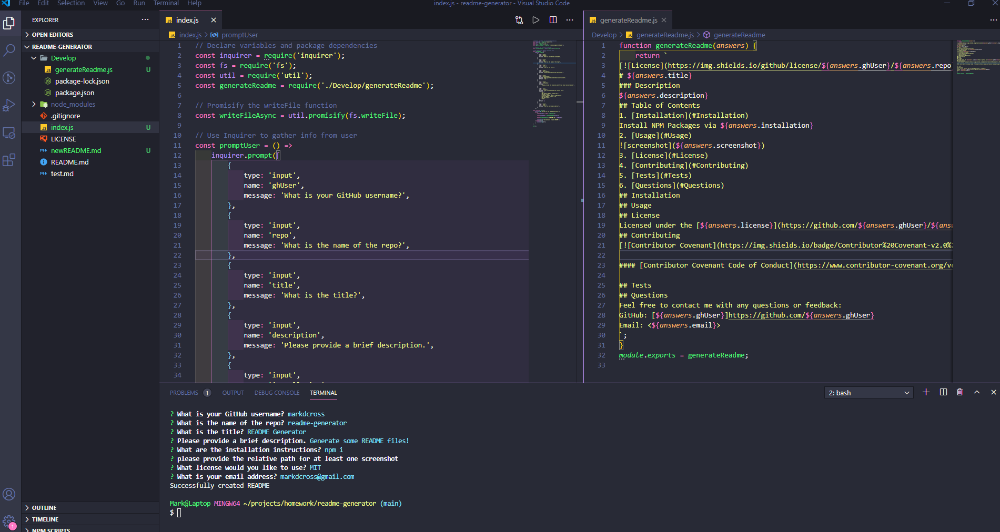

# README Generator

## Description

When creating an open source project on GitHub, it is important to have a quality README with information about the app--what is the app for, how to use the app, how to install it, how to report issues, and how to make contributions so that other developers are more likely to use and contribute to the success of the project. This is a command-line application that dynamically generates a professional README.md file from a user's input using the [Inquirer package](https://www.npmjs.com/package/inquirer). This will allow a project creator to spend more time working on finishing the project and less time creating a good README.

## Table of Contents

1. [Installation](#Installation)
2. [Usage](#Usage)
3. [License](#License)
4. [Contributing](#Contributing)
5. [Tests](#Tests)
6. [Questions](#Questions)

## Installation

Install NPM Packages via `$ npm i`

## Usage

Open the working directory and invoke the command `$ node index.js`. Respond to the prompts, and your README will be added to the working directory as `newREADME.md` for further manipulation as needed.

## License

Licensed under the [MIT](https://github.com/markdcross/readme-generator/blob/master/LICENSE.txt) license.

## Contributing

#### [Contributor Covenant Code of Conduct](https://www.contributor-covenant.org/version/2/0/code_of_conduct/)

## Tests

## Questions

Feel free to contact me with any questions or feedback:
GitHub: [markdcross](https://github.com/markdcross)
Email: <markdcross@gmail.com>
